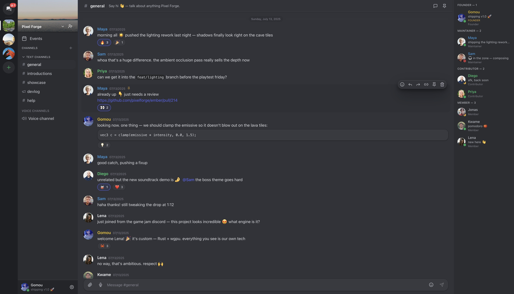
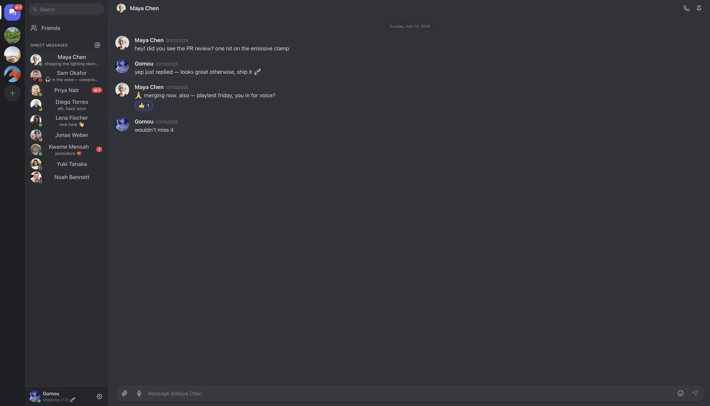
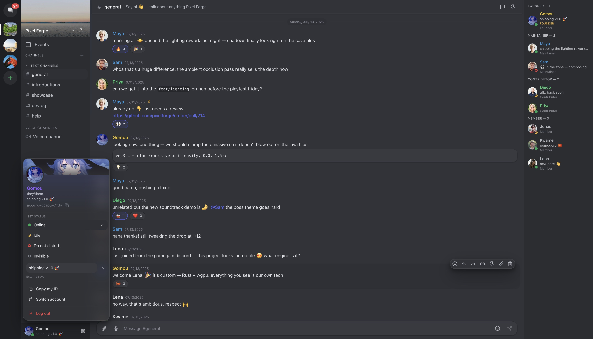
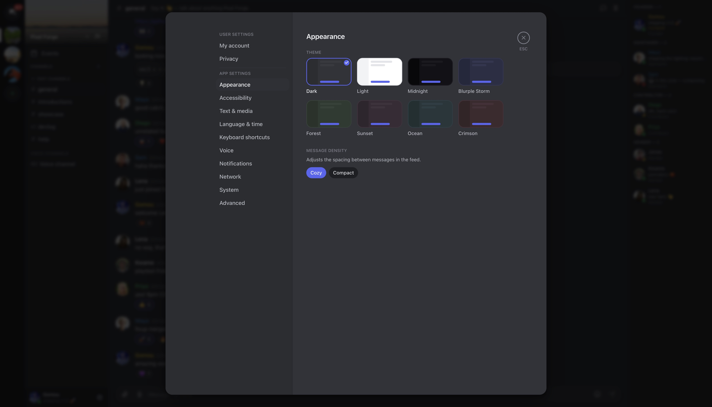

<p align="center">
  
</p>

<h1 align="center">Accord</h1>

<p align="center">
  <b>A Discord-like desktop app — peer-to-peer, end-to-end encrypted, no server.</b>
</p>

<p align="center">
  
</p>

Friends, DMs, servers with text & voice channels, 1-to-1 voice calls… but your
messages go **directly** between the apps, encrypted end to end. There is no
central server to host, read, or lose your conversations.

## Features

- 💬 **DMs and servers** — text, announcement and voice channels, categories,
  roles & permissions, moderation (kick/ban/timeout), pins, mentions,
  reactions, custom emojis, file sharing
- 📞 **Voice** — voice channels and 1-to-1 calls with ringing, noise
  suppression (RNNoise) and auto gain
- 🔐 **Private by design** — everything on the wire is end-to-end encrypted;
  everything on disk is encrypted with your passphrase; your identity is a
  12-word recovery phrase (no email, no phone)
- 🌐 **Serverless** — automatic NAT traversal (hole punching + relay
  fallback): friends connect without touching their router; offline friends
  receive messages through encrypted mailboxes (up to 7 days)
- 👥 **Multi-account**, light/dark themes, English & French

Accord protects the **content** of your exchanges, not your **anonymity**
(peers see your IP, like most P2P software). Details and limits:
[SECURITY.md](SECURITY.md). First stable release (**1.0**); the peer-to-peer
core has been through repeated internal adversarial security audits, but no
*external* audit yet.

## Screenshots

<table>
  <tr>
    <td width="33%" valign="top">
      <br/>
      <sub><b>Direct messages</b> — one-to-one, end-to-end encrypted</sub>
    </td>
    <td width="33%" valign="top">
      <br/>
      <sub><b>Profile &amp; status</b> — custom status, multi-account</sub>
    </td>
    <td width="33%" valign="top">
      <br/>
      <sub><b>Appearance</b> — eight themes, light &amp; dark</sub>
    </td>
  </tr>
</table>

## Install

Download from the **[latest release](https://github.com/Gomouu/accord/releases/latest)**:

| System | File | Note |
|--------|------|------|
| **macOS** (Apple Silicon) | `Accord_*_aarch64.dmg` | macOS will say the app is "damaged" (not notarized). Fix once: `xattr -cr /Applications/Accord.app` |
| **Windows** | `Accord_*_x64-setup.exe` | SmartScreen: **More info → Run anyway** (not code-signed) |
| **Linux** | `.deb` / `.AppImage` / `.rpm` | `sudo apt install ./Accord_*.deb`, etc. |

## Quick start

1. **Create your account** — pick a passphrase, then **write down the 12-word
   recovery phrase** (shown only once; it's the only way to restore your
   account on another machine).
2. **Add a friend** — exchange your friend codes (`WORD-WORD-WORD-1234`, shown
   in the Friends tab) and confirm on both sides.
3. **Create a server**, invite friends (they must accept), chat, join voice or
   call someone from a DM.

<details>
<summary><b>Build from source</b></summary>

Requirements: [Rust](https://rustup.rs) ≥ 1.85, [Node.js](https://nodejs.org) ≥ 20,
libopus + pkg-config (`brew install opus pkgconf` on macOS,
`sudo apt install libopus-dev` + the [Tauri prerequisites](https://tauri.app/start/prerequisites/) on Linux).

```sh
git clone https://github.com/Gomouu/accord && cd accord/app
npm ci
npm run tauri dev     # development
npm run tauri build   # installable app
```

First build takes several minutes (bundled SQLCipher and OpenSSL).

</details>

## Documentation

| Document | Contents |
|----------|----------|
| [SECURITY.md](SECURITY.md) | Threat model — guarantees and limits |
| [docs/THREAT-MODEL.md](docs/THREAT-MODEL.md) | Accepted trade-offs, in depth |
| [ARCHITECTURE.md](ARCHITECTURE.md) | Layer architecture |
| [SPEC.md](SPEC.md) | Wire protocol |
| [API.md](API.md) | UI ↔ node API |
| [docs/DEV.md](docs/DEV.md) | Developer guide |

## Authenticity & disclaimer

https://github.com/Gomouu/accord is the **only** official source of Accord —
don't trust copies found elsewhere. Accord is provided "as is", without
warranty; you are solely responsible for your use of it.

## License

[MIT](LICENSE) — © 2026 the Accord contributors.
